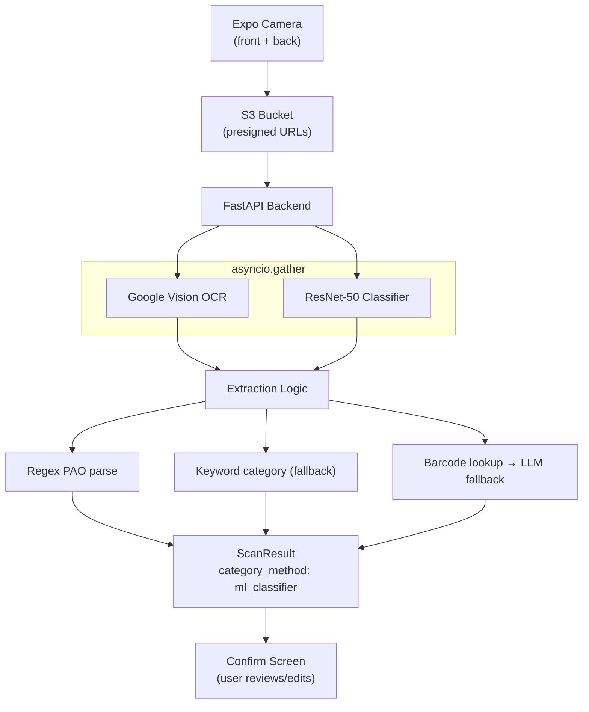

🛠️ ShelfLove is a work-in-progress mobile app that lets you scan and track the expiry dates of your cosmetics, with more features coming soon.

# ShelfLove CV Pipeline

The computer vision pipeline uses Google Cloud Vision API for OCR and a fine-tuned ResNet-50 PyTorch model for product category classification.
It extracts structured data (PAO months, product category, name, brand) from user-captured product photos and feeds the results into the scan flow for user confirmation.

---

## Architecture

---

## Usage

The CV pipeline is triggered automatically when the user completes the multi-step scan flow. Here's how it works:

1. **Capture photos**
   - The user photographs the front and back labels of their product using the Expo camera.
   - Images are uploaded directly to S3 via presigned URLs.

2. **Process images**
   - The backend downloads both images from S3.
   - OCR runs on both images via Google Cloud Vision API (concurrently).
   - The ML classifier runs on both images via the fine-tuned ResNet-50 (concurrently with OCR).

3. **Classify the product category**
   - The classifier predicts one of three categories: `skincare`, `makeup`, or `haircare`.
   - Predictions above a confidence threshold are accepted and category_method is set to "ml_classifier".
   - Below that threshold, the pipeline falls back to keyword-based classification from the OCR text.
   - When both front and back images are available, the classifier result with the highest confidence is used.

4. **Extract structured data**
   - Regex patterns extract the PAO (Period After Opening) value from OCR text (e.g. `12M`, `6 months`).
   - Barcode scan attempts an Open Beauty Facts API lookup for product name and brand.
   - If barcode lookup fails, an LLM fallback extracts name and brand from the OCR text.

5. **Return combined result to the scan flow**
   - The extraction result (category, PAO, name, brand) is persisted in PostgreSQL and returned to the frontend.
   - The user reviews and confirms the data on the confirmation screen before saving the product.

---

## Features

- Fine-tuned ResNet-50 for three-class cosmetic product classification (skincare, makeup, haircare)
- Dataset built from Open Beauty Facts product images (~200 category tags mapped to 3 classes)
- Training pipeline with weighted sampling, label smoothing, and early stopping
- ML classifier runs concurrently with OCR via `asyncio.gather` for minimal latency
- Confidence threshold (0.7) gates predictions; falls back to keyword matching when uncertain
- Best-of-two inference when both front and back images are available (picks highest confidence)

---

## Built With

- Inference: PyTorch, TorchVision, Pillow
- Training: PyTorch, scikit-learn, HuggingFace Datasets (Open Beauty Facts)
- OCR: Google Cloud Vision API
- Backend: FastAPI, SQLAlchemy, PostgreSQL
- Storage: AWS S3 (presigned URLs)
