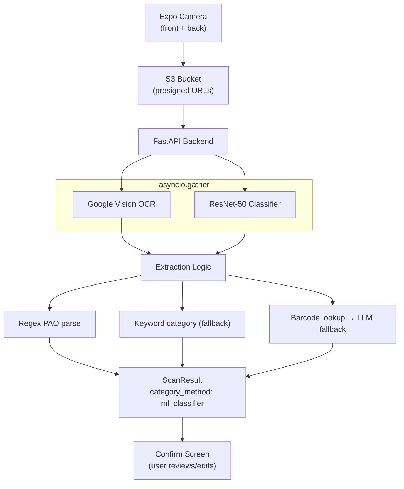
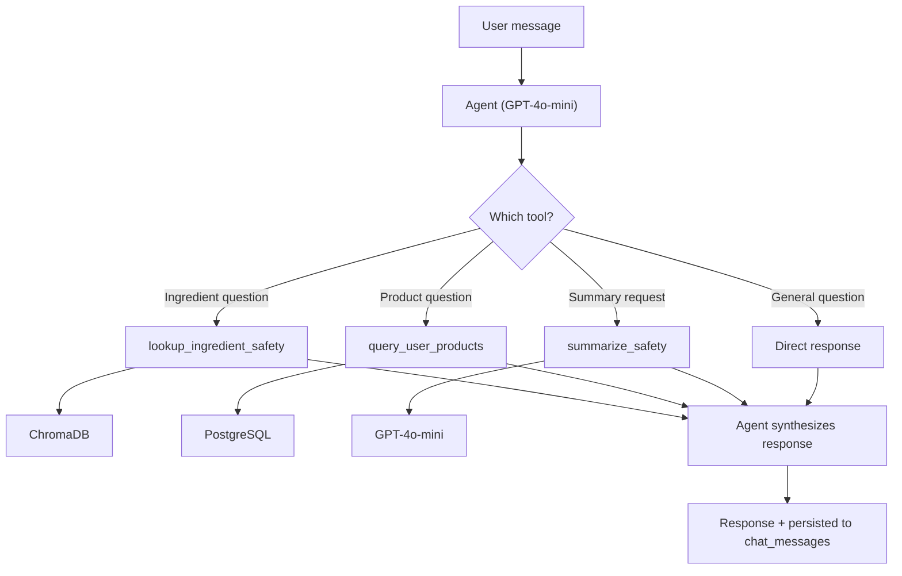

# Glasskyn

Glasskyn is a mobile skincare companion app built with React Native, TypeScript, FastAPI, and PostgreSQL, featuring a LangChain agent, RAG-based ingredient safety analysis, and a computer vision pipeline for product scanning.

It helps users track cosmetic expiry dates, understand ingredient safety, and manage personalized skincare routines through AI-powered chat and OCR-driven scanning.

## Download

🛠️ Work in progress; available in the App Store soon!

## Features

- Multi-step scan flow: capture front/back labels and auto-extract product name, brand, category, and PAO (expiry) date
- Barcode lookup via Open Beauty Facts, with LLM fallback when a product isn't found
- Ingredient safety analysis powered by a RAG pipeline over a ChromaDB vector store
- AI chat assistant for ingredient questions, product lookups, and safety summaries
- Skin profile onboarding and personalized routine builder (AM/PM steps, templates)
- Expiry and routine reminders via push notifications
- Symptom logging to track how your skin responds over time

## CV & Agent Pipelines

### CV Pipeline

The computer vision pipeline uses Google Cloud Vision API for OCR and a fine-tuned ResNet-50 PyTorch model for product category classification. It extracts structured data (PAO months, product category, name, brand) from user-captured product photos and feeds the results into the scan flow for user confirmation.

#### Architecture

#### How it works

1. **Capture** — user photographs the front and back labels via the Expo camera; images upload directly to S3 via presigned URLs.
2. **Process** — the backend downloads both images and runs OCR (Google Cloud Vision) and the ResNet-50 classifier concurrently via `asyncio.gather`.
3. **Classify** — the classifier predicts `skincare`, `makeup`, or `haircare`. Predictions above a 0.7 confidence threshold are accepted (`category_method: "ml_classifier"`); below threshold, the pipeline falls back to keyword matching on the OCR text. When both images are available, the higher-confidence result wins.
4. **Extract** — regex parses the PAO (Period After Opening) value from OCR text (e.g. `12M`, `6 months`); a barcode scan attempts an Open Beauty Facts lookup for product name and brand, falling back to an LLM extraction from OCR text if that fails.
5. **Confirm** — the combined result (category, PAO, name, brand) is persisted in PostgreSQL and returned to the frontend for user review before saving.

#### Model details

- Fine-tuned ResNet-50 for three-class classification, trained on Open Beauty Facts product images (~200 category tags mapped to 3 classes)
- Training pipeline uses weighted sampling, label smoothing, and early stopping
- Built with: PyTorch, TorchVision, Pillow, scikit-learn, HuggingFace Datasets

---

### Agent Pipeline

Glasskyn uses a LangChain agent to power its chat assistant. The agent runs a ReAct loop (Reason + Act) to decide which tools to call based on the user's question, then synthesizes a response from the tool results.

#### Tools

| Tool | Description | Backed by |
|------|-------------|-----------|
| `lookup_ingredient_safety` | Look up safety scores, risks, and benefits for cosmetic ingredients | ChromaDB (ingredient safety embeddings) |
| `query_user_products` | Query the user's saved products, filterable by type or category | PostgreSQL (`products` table) |
| `summarize_safety` | Convert raw ingredient data into a plain-language safety summary | GPT-4o-mini |

#### Flow

#### Conversation & personalization

- Each message carries a `session_id`; the backend loads prior messages from `chat_messages` and passes them to the agent as context, so it can reference earlier tool calls and responses.
- All new messages (user, assistant, tool calls, tool results) are persisted after each turn.
- The agent's system prompt is dynamically built from the user's skin profile (type, concerns, goals, sensitivity), letting it personalize answers without an extra tool call.

#### Key files

| File | Purpose |
|------|---------|
| `app/services/agent.py` | Agent factory, system prompt, skin profile injection |
| `app/services/agent_tools.py` | Tool definitions (LangChain `@tool` decorators) |
| `app/routers/chat.py` | Chat API endpoints (POST /chat, GET messages, DELETE session) |
| `app/models/chat.py` | `ChatMessage` model (conversation persistence) |
| `app/schemas/chat.py` | Pydantic request/response schemas |

---

## Built With

- Backend: FastAPI, SQLAlchemy, PostgreSQL
- Storage: AWS S3 (presigned URLs)
- CV/ML: PyTorch, TorchVision, Google Cloud Vision API, scikit-learn
- Agent: LangChain, LangGraph, ChromaDB, OpenAI GPT-4o-mini

## Built With

**Backend:** FastAPI, SQLAlchemy, PostgreSQL
**Storage:** AWS S3 (presigned URLs)
**CV/ML:** PyTorch, TorchVision, Google Cloud Vision API, scikit-learn
**Agent:** LangChain, LangGraph, ChromaDB, OpenAI GPT-4o-mini
